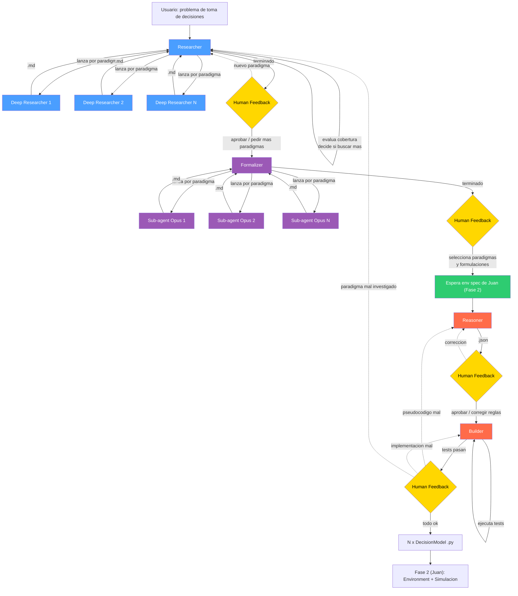

# Fase 1: Diseno del Pipeline de Modelado de Toma de Decisiones

**TFG**: Laboratorio virtual para la simulacion y analisis de paradigmas de toma de decisiones humanas mediante agentes inteligentes

**Alumno**: Pablo (Fase 1 — complementaria a la Fase 2 de Juan Freire Alvarez)
**Tutor**: Eduardo Manuel Sanchez Vila

---

## 1. Vision general

Pipeline de 4 agentes LLM que, dado un problema de toma de decisiones (ej: "comportamiento alimentario"), produce N agentes autonomos (codigo Python) listos para ejecutarse en la plataforma de simulacion de la Fase 2.

El pipeline busca en literatura cientifica real, identifica multiples paradigmas, genera formulaciones matematicas alternativas para cada uno, y — una vez el humano selecciona las formulaciones y Juan provee el environment — las adapta y las implementa como clases `DecisionModel`.

Un **Router** (orquestador Python + LLM) gestiona el human feedback despues de cada etapa y decide a que agente rellamar cuando algo necesita correccion.



**Leyenda**: azul = Sonnet (investigacion), morado = Opus (formalizacion), rojo = Opus (razonamiento/codigo), amarillo = human feedback, verde = integracion con Fase 2

---

## 2. Decisiones de diseno

| Decision | Valor | Razon |
|----------|-------|-------|
| Tecnologia agentes | Anthropic Agent SDK | Balance control/productividad, 100% Anthropic |
| Modelo LLM (Researcher) | Claude Sonnet | Busqueda y sintesis no requieren razonamiento extremo |
| Modelo LLM (Formalizer) | Claude Opus (subagentes) | Formalizacion matematica requiere capacidad maxima |
| Modelo LLM (Reasoner, Builder) | Claude Opus | Adaptacion a env y generacion de codigo requieren mayor capacidad |
| Fuentes de busqueda | Web search (DuckDuckGo) | Descubrimiento amplio, gratuito |
| Formato Researcher → Formalizer | Markdown | Investigacion profunda es texto narrativo |
| Formato Formalizer → Human | Markdown + LaTeX | Formulaciones matematicas legibles |
| Formato Reasoner → Builder | JSON | Datos estructurados para generar codigo |
| Interfaz | CLI primero, web despues | MVP rapido, separar logica de presentacion |
| Output final | `.py` compatible con `DecisionModel` (Fase 2) | Se enchufa directamente en el Environment de Juan |
| Sub-agentes del Researcher | En paralelo, 1 por paradigma (Sonnet) | Cada uno investiga de forma independiente |
| Sub-agentes del Formalizer | En paralelo, 1 por paradigma (Opus) | Cada uno genera n formulaciones independientemente |
| Reasoner, Builder | 1 agente cada uno, procesa secuencialmente | No necesitan contexto cruzado entre formulaciones |
| Loop de tests del Builder | Automatico (max 3 reintentos) | Solo escala al humano si no converge |
| Modelos generados | Independientes (sin IntegratedModel) | No todas las formulaciones son combinables; la integracion queda para el humano |

### Por que 4 agentes y no menos?

La separacion existe por dos razones: **puntos de human feedback** y **separacion de responsabilidades cognitivas**.

```
Researcher ──(md)──> [usuario revisa investigacion]
    ──> Formalizer ──(md+latex)──> [usuario selecciona formulaciones]
    ──> [Juan genera env spec] ──> Reasoner ──(json)──> [usuario revisa spec]
    ──> Builder
```

1. **Despues del Researcher**: el usuario revisa paradigmas descubiertos.
2. **Despues del Formalizer**: el usuario selecciona paradigmas y formulaciones. Doble nivel: primero paradigmas, luego formulaciones dentro de cada uno.
3. **Espera de env spec**: el pipeline de Juan genera el Environment basandose en los paradigmas. Esto ocurre antes del Reasoner.
4. **Despues del Reasoner**: el usuario revisa las specs adaptadas al environment.
5. **Despues del Builder**: el usuario revisa implementacion final.

La separacion Researcher/Formalizer es critica: el Researcher (Sonnet) investiga teorias; el Formalizer (Opus) genera matematicas. Mezclarlos obligaria a usar Opus para busqueda web (caro e innecesario) o Sonnet para formalizacion matematica (insuficiente).

---

## 3. Los 4 agentes

### 3.1 Researcher

**Rol**: Dado un problema de toma de decisiones, buscar en la web para identificar paradigmas relevantes (amplitud), y luego lanzar sub-agentes para investigar cada paradigma en profundidad. No produce formulaciones matematicas.

**Modelo LLM**: Claude Sonnet

**Tools**:

| Tool | Descripcion | Implementacion |
|------|-------------|----------------|
| `web_search(query)` | Busqueda web general | DuckDuckGo |
| `launch_deep_research(paradigm)` | Lanzar sub-agente para investigar un paradigma | Spawn de sub-agente (Sonnet) |
| `read_report(paradigm)` | Leer deep report completo (si se necesita mas detalle) | Lectura de fichero |

**Input**: Problema de toma de decisiones en lenguaje natural (string del usuario).

**Mecanismo**:
1. El Researcher realiza 2-3 busquedas web con diferentes angulos
2. Cuando identifica un paradigma, llama a `launch_deep_research(paradigm)`
3. El sub-agente investiga en profundidad (fundamentos, postulados, variables) y devuelve resumen
4. El Researcher evalua cobertura y puede lanzar sub-agentes adicionales
5. Produce `paradigms.md` como report resumen

**Tools de los sub-agentes (DeepResearcher)**:

| Tool | Descripcion | Implementacion |
|------|-------------|----------------|
| `web_search(query)` | Buscar contenido especifico del paradigma | DuckDuckGo |

**Output**:

```
outputs/<run_id>/01_researcher/
├── paradigms.md            # Report resumen
├── homeostatic.md          # Deep report (sin matematicas)
├── hedonic.md
└── prospect_theory.md
```

`paradigms.md` — resumen:

```markdown
# Decision-making paradigms: food intake behavior

## 1. Homeostatic model
Physiological hunger regulation based on hormonal signals...

**Key authors**: Jacquier et al. (2014), Woods & Ramsay (2011)
**Key concepts**: ghrelin, leptin, energy balance
```

Cada `<paradigm>.md` — deep report:

```markdown
# Homeostatic model — Deep research

## Foundations
{Origin, key researchers, theoretical basis}

## Postulates
P1. {Falsifiable statement} ({Author, Year})

## Assumptions
- {Each assumption}

## Predictions
- {Observable behaviors predicted}

## Identified variables
| Variable | Role | Behavior |
|----------|------|----------|

## References
- {Author (Year)} - {Title}
```

**Nota**: los deep reports NO incluyen seccion de formulacion matematica. Eso es responsabilidad del Formalizer.

---

### 3.2 Formalizer

**Rol**: Dado el output del Researcher (deep reports sin mates), generar n formulaciones matematicas alternativas por paradigma. Lanza un subagente Opus por paradigma en paralelo.

**Modelo LLM**: Claude Opus (subagentes)

**Mecanismo**:
1. El Router le pasa la lista de paradigmas aprobados + sus deep reports
2. Por cada paradigma, lanza un subagente Opus en paralelo (`asyncio.gather`)
3. Cada subagente decide cuantas formulaciones tiene sentido generar (tipicamente 2-5)
4. Output: markdown con LaTeX por paradigma

**Tools (orquestador)**:

| Tool | Descripcion | Implementacion |
|------|-------------|----------------|
| `read_file(path)` | Leer deep report del Researcher | Lectura de fichero |
| `launch_formalization(paradigm)` | Lanzar subagente Opus para un paradigma | Spawn de sub-agente (Opus) |

**Tools de cada subagente Opus**:

| Tool | Descripcion | Implementacion |
|------|-------------|----------------|
| `web_search(query)` | Buscar formulaciones matematicas en literatura | DuckDuckGo |

**System prompt del subagente Opus**:

```
You are a mathematical modeler. Given a decision-making paradigm's
theoretical foundations, produce multiple alternative mathematical
formulations.

## Process

1. Read the theoretical foundations provided.
2. Run 2-3 web searches for existing mathematical formulations
   of this paradigm in the literature.
3. Produce N alternative formulations (as many as meaningfully
   distinct approaches exist — typically 2-5).
4. Each formulation must be self-contained and independently viable.

## Constraints

- Only propose formulations grounded in the literature or
  logically derivable from the postulates.
- Never fabricate references.
- Each formulation must differ meaningfully (different equation
  types, different variable relationships, different assumptions).

## Output format

# {Paradigm name} — Mathematical formulations

## Formulation 1: {descriptive name}
**Approach**: {one-line description}
**Based on**: {Author (Year) or "derived from postulates P1, P3"}

### Variables
| Symbol | Name | Description | Type |
|--------|------|-------------|------|

### Parameters
| Symbol | Name | Default | Source |
|--------|------|---------|--------|

### Equations
$$
{LaTeX equations}
$$

### Decision logic
{How the agent decides based on this formulation}

## Formulation 2: {descriptive name}
...
```

**Output**:

```
outputs/<run_id>/02_formalizer/
├── homeostatic.md          # N formulaciones
├── hedonic.md
└── prospect_theory.md
```

**Seleccion humana (dos niveles)**:
1. El humano revisa los paradigmas y descarta los que no le interesan
2. Dentro de cada paradigma seleccionado, elige las formulaciones que quiere convertir en agentes

---

### 3.3 Reasoner

**Rol**: Adaptar cada formulacion seleccionada al environment concreto de Juan (Fase 2) y producir un JSON spec estructurado para el Builder.

**Modelo LLM**: Claude Opus

**Input**:
- Formulaciones seleccionadas (markdown + LaTeX, del Formalizer)
- Env spec (output de `Environment.get_spec()` de Juan)
- Deep report del Researcher (contexto teorico)

**Tools**:

| Tool | Descripcion | Implementacion |
|------|-------------|----------------|
| `read_file(path)` | Leer formulaciones, deep report, env spec | Lectura de fichero |

Sin web search — el Formalizer ya hizo la busqueda. El Reasoner es puro razonamiento.

**Ejecucion**: 1 agente, procesa cada formulacion secuencialmente.

**Que hace concretamente**:
1. Lee env spec → sabe acciones disponibles, recursos, grid
2. Lee formulacion → tiene ecuaciones, variables, parametros
3. Mapea variables ↔ environment
4. Genera JSON spec con `env_mapping`

**Output** (un JSON por formulacion seleccionada):

```
outputs/<run_id>/03_reasoner/
├── homeostatic_ode_v2.json
├── hedonic_td_v1.json
└── hedonic_rw_v3.json
```

Estructura JSON:

```json
{
  "formulation_id": "homeostatic_ode_v2",
  "paradigm": "homeostatic",
  "name": "Homeostatic ODE model (Jacquier variant)",
  "description": "...",
  "variables": [
    {
      "symbol": "F",
      "name": "fat_reserves",
      "description": "Body fat reserves",
      "type": "float",
      "initial_value": 50.0,
      "range": [0, 100]
    }
  ],
  "parameters": [
    {
      "symbol": "cF",
      "name": "fat_conversion_rate",
      "default": 0.3,
      "source": "Jacquier et al., 2014"
    }
  ],
  "rules": [
    {
      "id": "R1",
      "description": "Fat reserves update",
      "type": "ODE",
      "pseudocode": "dF_dt = cF * intake - alphaF * F",
      "source_postulate": "P1"
    }
  ],
  "decision_logic": {
    "description": "Agent decision rule",
    "pseudocode": [
      "if hunger > threshold AND food at position: return Action('eat')",
      "if hunger > threshold: return Action(move toward nearest food)",
      "else: return Action('stay')"
    ]
  },
  "env_mapping": {
    "perception_to_variables": {
      "ate_food": "last_action_result.consumed == true",
      "position": "(perception.x, perception.y)",
      "food_sources": "perception.resources.food"
    },
    "actions_used": ["up", "down", "left", "right", "stay", "eat"],
    "reward_source": "eat action → ConsumeEffect reward"
  },
  "expected_behaviors": [
    {
      "id": "B1",
      "description": "Hunger increases without eating",
      "test_pseudocode": "run 100 steps without food → assert hunger increases"
    }
  ],
  "references": []
}
```

---

### 3.4 Builder

**Rol**: Implementar cada JSON del Reasoner como codigo Python que cumple el Protocol `DecisionModel` de la Fase 2. Genera modelos independientes (sin IntegratedModel). Incluye tests y perception mapper.

**Modelo LLM**: Claude Opus

**Tools**:

| Tool | Descripcion | Implementacion |
|------|-------------|----------------|
| `read_file(path)` | Leer JSON del Reasoner | Lectura de fichero |
| `read_framework_api(path)` | Leer API del environment de Juan | Lectura de fichero |
| `write_code(path, content)` | Escribir fichero Python | Escritura a disco |
| `run_tests(path)` | Ejecutar pytest | Subprocess |

**Ejecucion**: 1 agente, procesa cada formulacion secuencialmente. Loop interno de test-fix.

**Output** (por formulacion):

```
outputs/<run_id>/04_builder/
├── homeostatic_ode_v2_model.py
├── homeostatic_ode_v2_mapper.py
├── test_homeostatic_ode_v2.py
├── hedonic_td_v1_model.py
├── hedonic_td_v1_mapper.py
├── test_hedonic_td_v1.py
└── ...
```

El `_mapper.py` contiene la funcion `perception_mapper` para el `ModelAdapter` de Juan.

Loop interno:

```
Builder lee JSON spec
    |
    v
Genera model.py + mapper.py + tests
    |
    v
Ejecuta pytest
    |
    ├── PASS → siguiente formulacion
    |
    └── FAIL → lee errores, corrige, re-testea
              (max 3 reintentos, luego escala al humano)
```

---

## 4. Router

### 4.1 Rol

El Router gestiona el human feedback, la seleccion de formulaciones, la espera de env spec de Juan, y el re-routing. Es una combinacion de:
- **Codigo Python**: logica de flujo, prompts de feedback
- **LLM (Claude Sonnet)**: interpretar feedback del usuario para decidir a que agente rellamar

### 4.2 Flujo principal

```python
def run_pipeline(problem: str):
    # 1. Researcher
    researcher_result = researcher.run(problem)

    # --- Human feedback ---
    feedback = ask_user_feedback()
    while feedback.wants_more:
        researcher.run_extra(feedback.new_paradigm)
        feedback = ask_user_feedback()

    # 2. Formalizer (subagentes Opus en paralelo)
    formulations = formalizer.run(approved_paradigms)

    # --- Human feedback (doble nivel) ---
    selected = ask_user_selection(formulations)
    # Nivel 1: seleccionar paradigmas
    # Nivel 2: seleccionar formulaciones dentro de cada paradigma

    # --- Espera env spec de Juan (Fase 2) ---
    env_spec = ask_user_input("Paste env spec JSON from Phase 2")

    # 3. Reasoner (secuencial)
    for f in selected_formulations:
        spec = reasoner.run(f, env_spec)

    # --- Human feedback ---
    feedback = ask_user_feedback()
    while feedback.has_corrections:
        reasoner.rerun(feedback.corrections)
        feedback = ask_user_feedback()

    # 4. Builder (secuencial con loop interno)
    for spec in approved_specs:
        result = builder.run(spec)
        if not result.tests_passed:
            escalate_to_user(result.errors)

    # --- Human feedback ---
    feedback = ask_user_feedback()
    while feedback.has_issues:
        target = router_llm.decide_target(feedback)
        rerun_agent(target, feedback)
        feedback = ask_user_feedback()

    present_final_results()
```

### 4.3 Logica de routing del feedback

El Router usa un LLM (Sonnet) para interpretar el feedback del usuario:

```
Usuario: "el modelo homeostatico no esta calculando bien la leptina"

Router LLM analiza:
  - Es un problema de implementacion (Builder) o de especificacion (Reasoner)?
  - Examina el JSON del Reasoner: la regla de leptina esta correcta?
    - Si: rellamar Builder con contexto del error
    - No: rellamar Reasoner para corregir la regla, luego Builder
```

---

## 5. Comunicacion entre agentes

### 5.1 Flujo de datos y formatos

```
Researcher          Formalizer          Reasoner            Builder
(Sonnet + subs)     (Opus subs)         (Opus)              (Opus)

[web_search]        [web_search]        [read_file]         [read_file]
[launch_deep_res]   [launch_formal]                         [read_framework_api]
[read_report]       [read_file]                             [write_code]
                                                            [run_tests]

     |                   |                   |                   |
     v                   v                   v                   v
paradigms.md        <form>.md           <form>.json         <form>_model.py
<paradigm>.md ─(md)─> (md+latex) ─(md)─> (json) ──────────> <form>_mapper.py
                                                            test_<form>.py
```

### 5.2 Puntos de human feedback

| Momento | Que puede hacer el usuario | Que hace el Router |
|---------|---------------------------|-------------------|
| Despues del Researcher | Aprobar o pedir paradigmas adicionales | Rellamar Researcher |
| Despues del Formalizer | Seleccionar paradigmas y formulaciones (doble nivel) | Filtrar para Reasoner |
| Espera env spec | Proveer env spec de Juan (Fase 2) | Pasar a Reasoner |
| Despues del Reasoner | Aprobar o corregir specs | Rellamar Reasoner |
| Despues del Builder | Reportar fallos | Interpretar y rellamar agente correspondiente |

### 5.3 Estructura de ficheros de un run completo

```
outputs/
└── 2026-03-14_food_intake/
    ├── 01_researcher/
    │   ├── paradigms.md
    │   ├── homeostatic.md
    │   ├── hedonic.md
    │   └── prospect_theory.md
    ├── 02_formalizer/
    │   ├── homeostatic.md          # N formulaciones
    │   ├── hedonic.md
    │   └── prospect_theory.md
    ├── 03_reasoner/
    │   ├── homeostatic_ode_v2.json
    │   ├── hedonic_td_v1.json
    │   └── hedonic_rw_v3.json
    ├── env_spec.json               # De Juan (Fase 2)
    └── 04_builder/
        ├── homeostatic_ode_v2_model.py
        ├── homeostatic_ode_v2_mapper.py
        ├── test_homeostatic_ode_v2.py
        ├── hedonic_td_v1_model.py
        ├── hedonic_td_v1_mapper.py
        ├── test_hedonic_td_v1.py
        └── ...
```

---

## 6. Stack tecnico

| Componente | Tecnologia |
|------------|------------|
| Lenguaje | Python (uv) |
| SDK agentes | Anthropic Agent SDK |
| LLM Researcher | Claude Sonnet |
| LLM Formalizer (subagentes) | Claude Opus |
| LLM Reasoner, Builder | Claude Opus |
| LLM Router (interpretar feedback) | Claude Sonnet (candidato a Haiku) |
| Busqueda web | DuckDuckGo (ddgs) |
| Interfaz | CLI (rich/typer) → web despues |
| Persistencia | Markdown + JSON en disco |
| Tests | pytest |
| Output final | `.py` compatible con `DecisionModel` (Fase 2) |

---

## 7. Relacion con la Fase 2 (Juan)

El punto de integracion es el **Protocol `DecisionModel`** de la Fase 2 y el **env spec**:

```python
# Definido en la Fase 2
class DecisionModel(Protocol):
    def decide(self, perception: dict) -> Action: ...
    def update(self, action: Action, reward: float, new_perception: dict) -> None: ...
    def get_state(self) -> dict: ...
```

El flujo cross-phase:

```
Fase 1: Researcher → paradigmas → humano aprueba
Fase 1: Formalizer → formulaciones → humano selecciona
Fase 2: Juan genera Environment basandose en paradigmas → env spec
Fase 1: Reasoner (con env spec) → JSON specs
Fase 1: Builder → N x DecisionModel .py + perception_mapper .py
Fase 2: Environment.add_agent(ModelAdapter(model, mapper)) → simulacion
```

El `env_spec` es el output de `Environment.get_spec()`:

```json
{
  "available_actions": ["up", "down", "left", "right", "stay", "eat"],
  "resource_types": {
    "food": {"properties": {"palatability": [0.1, 1.0]}, "count": 2, "regenerate": true}
  },
  "grid": {"width": 5, "height": 5}
}
```

Los `.py` generados por el Builder incluyen un `perception_mapper` para el `ModelAdapter` de Juan, de modo que se enchufan directamente en el Environment sin adaptacion manual.
