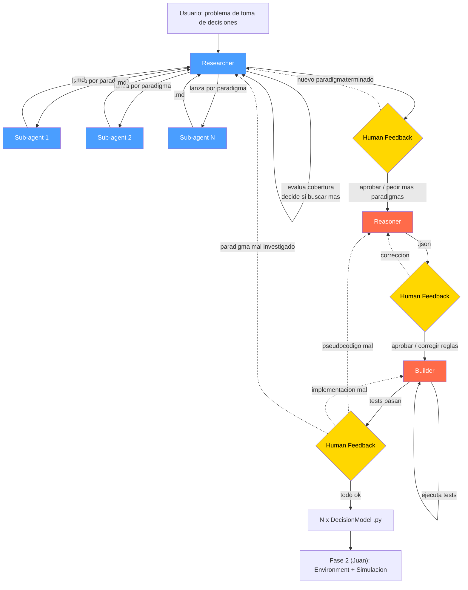

# Fase 1: Diseno del Pipeline de Modelado de Toma de Decisiones

**TFG**: Laboratorio virtual para la simulacion y analisis de paradigmas de toma de decisiones humanas mediante agentes inteligentes

**Alumno**: Pablo (Fase 1 — complementaria a la Fase 2 de Juan Freire Alvarez)
**Tutor**: Eduardo Manuel Sanchez Vila

---

## 1. Vision general

Pipeline de 3 agentes LLM que, dado un problema de toma de decisiones (ej: "comportamiento alimentario"), produce N agentes autonomos (codigo Python) listos para ejecutarse en la plataforma de simulacion de la Fase 2.

El pipeline busca en literatura cientifica real, identifica multiples paradigmas, formaliza cada uno como pseudocodigo/reglas, los implementa como clases `DecisionModel` y valida que la implementacion cumple la especificacion.

Un **Router** (orquestador Python + LLM) gestiona el human feedback despues de cada etapa y decide a que agente rellamar cuando algo necesita correccion.



**Leyenda**: azul = Sonnet, rojo = Opus, amarillo = human feedback

---

## 2. Decisiones de diseno

| Decision | Valor | Razon |
|----------|-------|-------|
| Tecnologia agentes | Anthropic Agent SDK | Balance control/productividad, 100% Anthropic |
| Modelo LLM (Researcher) | Claude Sonnet | Busqueda y sintesis no requieren razonamiento extremo |
| Modelo LLM (Reasoner, Builder) | Claude Opus | Formalizacion, generacion de codigo y validacion requieren mayor capacidad |
| Fuentes de busqueda | Web search + Semantic Scholar API | Descubrimiento amplio + metadata academica verificable |
| Formato Researcher → Reasoner | Markdown | La investigacion profunda es texto narrativo |
| Formato Reasoner → Builder | JSON | Datos estructurados para generar codigo |
| Interfaz | CLI primero, web despues | MVP rapido, separar logica de presentacion |
| Output final | `.py` compatible con `DecisionModel` (Fase 2) | Se enchufa directamente en el Environment de Juan |
| Sub-agentes del Researcher | En paralelo, 1 por paradigma | Cada uno investiga de forma independiente |
| Reasoner, Builder | 1 agente cada uno, procesa secuencialmente | No necesitan contexto cruzado entre paradigmas |
| Loop de tests del Builder | Automatico (max N reintentos) | Solo escala al humano si no converge |

### Por que 3 agentes y no menos?

Tecnicamente los agentes se podrian fusionar mas — el Researcher ya tiene todo el conocimiento para producir reglas formalizadas, y el Builder podria incluir el paso de formalizacion del Reasoner. Sin embargo, la separacion en 3 existe por los **puntos de human feedback**:

```
Researcher ──(md)──> [usuario revisa investigacion] ──> Reasoner ──(json)──> [usuario revisa spec] ──> Builder
```

Cada frontera entre agentes corresponde a un punto donde el usuario interviene:

1. **Despues del Researcher**: el usuario revisa la investigacion y puede pedir mas paradigmas o senalar investigaciones incompletas. Sin esta frontera, la formalizacion procederia sobre investigacion potencialmente erronea o insuficiente.
2. **Despues del Reasoner**: el usuario revisa el pseudocodigo/reglas y puede corregirlas antes de que se genere codigo. Esto es critico — corregir una regla mal en JSON es mucho mas barato que depurar codigo generado que implementa una regla incorrecta.
3. **Despues del Builder**: el usuario revisa la implementacion final y los resultados de tests. Si algo esta mal, el Router determina si rellamar al Reasoner (problema de spec) o al Builder (problema de implementacion).

Ademas, el Researcher usa **Sonnet** (mas barato, suficiente para busqueda/sintesis) mientras que el Reasoner y Builder usan **Opus** (necesario para formalizacion matematica y generacion de codigo). Fusionarlos obligaria a usar el modelo mas caro para todo el pipeline.

Si se eliminase el human-in-the-loop, Researcher + Reasoner podrian fusionarse sin problema. Pero el feedback es un requisito de diseno central.

---

## 3. Los 3 agentes

### 3.1 Researcher

**Rol**: Dado un problema de toma de decisiones, buscar en la web para identificar paradigmas relevantes (amplitud), y luego lanzar sub-agentes para investigar cada paradigma en profundidad. Evalua la cobertura de los resultados y decide si seguir buscando.

**Modelo LLM**: Claude Sonnet

**Tools**:

| Tool | Descripcion | Implementacion |
|------|-------------|----------------|
| `web_search(query)` | Busqueda web general | Brave Search API |
| `search_papers(query, limit)` | Buscar papers academicos | Semantic Scholar API |
| `fetch_paper(paper_id)` | Obtener abstract y metadata | Semantic Scholar API |
| `launch_deep_research(paradigm)` | Lanzar un sub-agente para investigar un paradigma en profundidad | Spawn de sub-agente (Sonnet) |

**Input**: Problema de toma de decisiones en lenguaje natural (string del usuario).

**Mecanismo**:
1. El Researcher realiza multiples busquedas (puede llamar `web_search` y `search_papers` en paralelo)
2. Cuando identifica un paradigma que merece investigacion, llama a `launch_deep_research(paradigm)` que lanza un sub-agente
3. El sub-agente investiga el paradigma en profundidad (busca papers especificos, lee abstracts, sintetiza) y devuelve un report en markdown
4. El Researcher recibe el resultado del sub-agente y evalua la cobertura general
5. Si considera la cobertura insuficiente, busca mas y lanza sub-agentes adicionales
6. Cuando esta satisfecho, produce `paradigms.md` como report resumen y termina

**Tools de los sub-agentes** (mismas tools de busqueda, enfocadas en un paradigma):

| Tool | Descripcion | Implementacion |
|------|-------------|----------------|
| `web_search(query)` | Buscar contenido especifico del paradigma | Brave Search API |
| `search_papers(query, limit)` | Buscar papers especificos | Semantic Scholar API |
| `fetch_paper(paper_id)` | Obtener detalles de un paper | Semantic Scholar API |

**Output**:

```
outputs/<run_id>/01_researcher/
├── paradigms.md            # Report resumen para el usuario
├── homeostatic.md          # Investigacion profunda (de sub-agente)
├── hedonic.md              # Investigacion profunda (de sub-agente)
└── prospect_theory.md      # Investigacion profunda (de sub-agente)
```

`paradigms.md` — resumen de todos los paradigmas encontrados:

```markdown
# Decision-making paradigms: food intake behavior

## 1. Homeostatic model
Physiological hunger regulation based on hormonal signals
(ghrelin, leptin) and energy reserves (fat, glycogen).

**Authors**: Jacquier et al. (2014), Woods & Ramsay (2011)
**Key concepts**: ghrelin, leptin, energy balance, ODEs
**References**:
- Jacquier et al. (2014) - DOI: 10.1371/journal.pone.0100073
- ...

## 2. Hedonic model (Q-Learning)
...
```

Cada `<paradigm>.md` — investigacion profunda por paradigma:

```markdown
# Homeostatic model — Deep research

## Foundations
Homeostatic regulation maintains the organism's energy balance
through a system of hormonal signals...

## Postulates
P1. Hunger is proportional to ghrelin and inversely proportional
    to leptin (Jacquier et al., 2014)
P2. Ghrelin increases when glycogen reserves drop
P3. Leptin increases proportionally to fat reserves
P4. ...

## Assumptions
- The organism has finite fat and glycogen reserves
- Hormones degrade with constant half-life
- ...

## Predictions
- Hunger increases when glycogen reserves drop
- Eating reduces ghrelin and increases reserves
- ...

## Identified variables
| Variable | Role | Behavior |
|----------|------|----------|
| Ghrelin | Hunger signal | Increases with low glycogen |
| Leptin | Satiety signal | Increases with high fat |
| Fat | Energy reserve | Grows with intake, decreases with use |
| Glycogen | Fast energy reserve | Consumed by activity |

## References
- ...
```

---

### 3.2 Reasoner

**Rol**: Para cada markdown de investigacion, traducir los postulados cualitativos a pseudocodigo y/o reglas formales, produciendo un JSON estructurado que sirve como especificacion para el Builder y como contrato de validacion.

**Modelo LLM**: Claude Opus

**Tools**:

| Tool | Descripcion | Implementacion |
|------|-------------|----------------|
| `web_search(query)` | Buscar formulaciones matematicas existentes | Brave Search API |
| `search_papers(query, limit)` | Buscar papers con modelos formales | Semantic Scholar API |
| `fetch_paper(paper_id)` | Obtener detalles | Semantic Scholar API |
| `read_file(path)` | Leer markdown del Researcher | Lectura de fichero |

**Input**: Markdown de investigacion del Researcher (`<paradigm>.md`).

**Ejecucion**: 1 agente, procesa cada paradigma secuencialmente.

**Output** (por paradigma):

```
outputs/<run_id>/02_reasoner/
├── homeostatic.json
├── hedonic.json
└── prospect_theory.json
```

Estructura JSON:

```json
{
  "paradigm_id": "homeostatic",
  "name": "Homeostatic model",
  "description": "Physiological hunger regulation based on hormonal signals",
  "variables": [
    {
      "symbol": "F",
      "name": "fat_reserves",
      "description": "Body fat reserves",
      "type": "float",
      "unit": "g",
      "initial_value": 50.0,
      "range": [0, 100]
    },
    {
      "symbol": "Gly",
      "name": "glycogen",
      "description": "Hepatic glycogen",
      "type": "float",
      "unit": "g",
      "initial_value": 20.0,
      "range": [0, 50]
    },
    {
      "symbol": "G",
      "name": "ghrelin",
      "description": "Ghrelin concentration",
      "type": "float",
      "unit": "concentration",
      "initial_value": 0.1,
      "range": [0, 1]
    },
    {
      "symbol": "H",
      "name": "hunger",
      "description": "Hunger signal",
      "type": "float",
      "unit": "dimensionless",
      "initial_value": 0.5,
      "range": [0, 1]
    }
  ],
  "parameters": [
    {
      "symbol": "cF",
      "name": "fat_conversion_rate",
      "description": "Energy to fat conversion coefficient",
      "default": 0.3,
      "source": "Jacquier et al., 2014"
    },
    {
      "symbol": "alphaF",
      "name": "fat_usage_rate",
      "description": "Basal fat utilization rate",
      "default": 0.01,
      "source": "Jacquier et al., 2014"
    }
  ],
  "rules": [
    {
      "id": "R1",
      "description": "Fat reserves update",
      "type": "ODE",
      "pseudocode": "dF_dt = cF * intake - alphaF * F",
      "source_postulate": "P1"
    },
    {
      "id": "R2",
      "description": "Glycogen update",
      "type": "ODE",
      "pseudocode": "dGly_dt = cGly * intake - alphaGly * Gly - beta * activity",
      "source_postulate": "P2"
    },
    {
      "id": "R3",
      "description": "Hunger signal calculation",
      "type": "formula",
      "pseudocode": "H = max(0, ghrelin - gamma * leptin * sigmoid(F / Fmax - 0.5))",
      "source_postulate": "P1"
    }
  ],
  "decision_logic": {
    "description": "Agent decision rule",
    "pseudocode": [
      "if hunger > threshold AND food_nearby: return EAT",
      "if hunger > threshold: return MOVE_TO_FOOD",
      "else: return REST"
    ]
  },
  "expected_behaviors": [
    {
      "id": "B1",
      "description": "If the agent doesn't eat for many steps, hunger must increase",
      "test_pseudocode": "run 100 steps without food -> assert hunger increases"
    },
    {
      "id": "B2",
      "description": "After eating, hunger must decrease",
      "test_pseudocode": "eat -> assert hunger decreases in next steps"
    }
  ],
  "references": []
}
```

Campos clave:
- `rules`: pseudocodigo de cada regla/ecuacion, vinculado al postulado de origen
- `decision_logic`: logica de decision del agente (lo que el Builder implementa en `decide()`)
- `expected_behaviors`: criterios de validacion que el Builder usa para testear la implementacion

---

### 3.3 Builder

**Rol**: Implementar cada JSON del Reasoner como codigo Python que cumple el Protocol `DecisionModel` de la Fase 2, generar tests basados en `expected_behaviors`, ejecutarlos y autocorregir si fallan (max N reintentos). Si no converge, escala al humano.

**Modelo LLM**: Claude Opus

**Tools**:

| Tool | Descripcion | Implementacion |
|------|-------------|----------------|
| `read_file(path)` | Leer JSON del Reasoner | Lectura de fichero |
| `read_framework_api(path)` | Leer la API del environment de Juan | Lectura de fichero |
| `write_code(path, content)` | Escribir fichero Python | Escritura a disco |
| `run_tests(path)` | Ejecutar pytest | Subprocess |

**Input**: JSON del Reasoner (`<paradigm>.json`) + API del framework de la Fase 2.

**Ejecucion**: 1 agente, procesa cada paradigma secuencialmente. Loop interno de test-fix.

**Output** (por paradigma):

```
outputs/<run_id>/03_builder/
├── homeostatic_model.py
├── test_homeostatic_model.py
├── hedonic_model.py
├── test_hedonic_model.py
├── prospect_theory_model.py
└── test_prospect_theory_model.py
```

Loop interno:

```
Builder lee JSON spec
    |
    v
Genera implementacion (.py) + tests (de expected_behaviors)
    |
    v
Ejecuta pytest
    |
    ├── PASS → terminado, pasa al siguiente paradigma
    |
    └── FAIL → lee errores, corrige codigo, re-testea
              (max 3 reintentos, luego escala al humano)
```

Ejemplo de codigo generado:

```python
from dataclasses import dataclass
from simlab.environment import Action, DecisionModel


@dataclass
class HomeostaticModel:
    """Homeostatic model for food intake regulation.
    Based on Jacquier et al. (2014).
    """

    # State variables (from JSON: variables[])
    fat_reserves: float = 50.0
    glycogen: float = 20.0
    ghrelin: float = 0.1
    leptin: float = 0.8
    hunger: float = 0.5

    # Parameters (from JSON: parameters[])
    fat_conversion_rate: float = 0.3
    fat_usage_rate: float = 0.01
    hunger_threshold: float = 0.4

    def decide(self, perception: dict) -> Action:
        """Implements decision_logic from JSON."""
        self._update_physiology(perception)

        if self.hunger > self.hunger_threshold and perception.get("food_nearby"):
            return Action(name="eat")
        elif self.hunger > self.hunger_threshold:
            return Action(name="move", params=self._toward_food(perception))
        else:
            return Action(name="rest")

    def _update_physiology(self, perception: dict) -> None:
        """Implements rules[] from JSON."""
        dt = 1
        intake = perception.get("last_intake", 0)

        # R1: dF_dt = cF * intake - alphaF * F
        self.fat_reserves += (self.fat_conversion_rate * intake
                              - self.fat_usage_rate * self.fat_reserves) * dt

        # R2, R3, etc.
        ...

        # R3: H = max(0, ghrelin - Leff)
        self.hunger = max(0, self.ghrelin - self._effective_leptin())
```

---

## 4. Router

### 4.1 Rol

El Router gestiona el human feedback y el re-routing despues de cada etapa del pipeline. NO interviene en el flujo inicial (el usuario promptea al Researcher directamente). Es una combinacion de:
- **Codigo Python**: logica de flujo, prompts de feedback
- **LLM (Claude Sonnet)**: interpretar feedback del usuario en lenguaje natural para decidir a que agente rellamar

> **Nota sobre modelo**: El Router realiza clasificacion simple (a que agente rellamar). Empezamos con Sonnet, pero es candidato a downgrade a Haiku si los costes lo justifican.

### 4.2 Flujo principal

```python
# Router pseudocode

def run_pipeline(problem: str):
    # 1. Researcher (el usuario promptea directamente)
    researcher_result = researcher.run(problem)
    # researcher_result incluye:
    #   - paradigms.md (resumen)
    #   - N x <paradigm>.md (investigacion profunda de sub-agentes)
    save("01_researcher/paradigms.md", researcher_result.summary)
    for p in researcher_result.paradigms:
        save(f"01_researcher/{p.id}.md", p.research)

    # --- Human feedback ---
    # El usuario puede:
    #   - Aprobar y continuar
    #   - Pedir investigar paradigmas adicionales
    feedback = ask_user_feedback()
    while feedback.wants_more:
        new_result = researcher.run_extra(feedback.new_paradigm)
        save(f"01_researcher/{feedback.new_paradigm.id}.md", new_result)
        researcher_result.paradigms.append(new_result)
        feedback = ask_user_feedback()

    # 2. Reasoner (secuencial)
    for p in researcher_result.paradigms:
        spec_json = reasoner.run(read(f"01_researcher/{p.id}.md"))
        save(f"02_reasoner/{p.id}.json", spec_json)

    # --- Human feedback ---
    # El usuario puede corregir pseudocodigo/reglas
    feedback = ask_user_feedback()
    while feedback.has_corrections:
        corrected = reasoner.run(feedback.corrections, rerun=p.id)
        save(f"02_reasoner/{p.id}.json", corrected)
        feedback = ask_user_feedback()

    # 3. Builder (secuencial con loop interno de tests)
    for p in researcher_result.paradigms:
        spec = read(f"02_reasoner/{p.id}.json")
        result = builder.run(spec)
        save(f"03_builder/{p.id}_model.py", result.code)
        save(f"03_builder/test_{p.id}_model.py", result.tests)

        if not result.tests_passed:
            escalate_to_user(p, result.errors)

    # --- Human feedback ---
    # El usuario revisa los resultados finales
    # Si algo esta mal, el Router interpreta y decide:
    feedback = ask_user_feedback()
    while feedback.has_issues:
        target = router_llm.decide_target(feedback)
        #   "pseudocodigo mal"    → rellamar Reasoner
        #   "implementacion mal"  → rellamar Builder
        #   "paradigma mal investigado" → rellamar Researcher
        rerun_agent(target, feedback)
        feedback = ask_user_feedback()

    present_final_results()
```

### 4.3 Logica de routing del feedback

El Router usa un LLM (Sonnet) para interpretar el feedback del usuario:

```
Usuario: "el modelo homeostatico no esta calculando bien la leptina"

Router LLM analiza:
  - Es un problema de implementacion (Builder) o de especificacion (Reasoner)?
  - Examina el JSON del Reasoner: la regla de leptina esta correcta?
    - Si: rellamar Builder con contexto del error
    - No: rellamar Reasoner para corregir la regla, luego Builder
```

---

## 5. Comunicacion entre agentes

### 5.1 Flujo de datos y formatos

```
Researcher                          Reasoner               Builder
(1 agente + N sub-agentes)          (1 agente)             (1 agente)

[web_search]                        [web_search]           [read_file]
[search_papers]                     [search_papers]        [read_framework_api]
[fetch_paper]                       [fetch_paper]          [write_code]
[launch_deep_research]              [read_file]            [run_tests]

     |                                   |                      |
     v                                   v                      v
paradigms.md                       <paradigm>.json         <paradigm>_model.py
<paradigm>.md ──(md)──────────>     (json)──────────────>  test_<paradigm>_model.py
                                        |                      |
                                        |            ┌─────────┘
                                        |            | (loop interno de tests)
                                        |            └──> run tests
                                        |                   |
                                        |              PASS / FAIL
                                        |                   |
                                        └───────────────────┘ (FAIL: relee spec)
```

### 5.2 Puntos de human feedback

| Momento | Que puede hacer el usuario | Que hace el Router |
|---------|---------------------------|-------------------|
| Despues del Researcher | Aprobar o pedir investigar paradigmas adicionales | Rellamar Researcher para el nuevo paradigma |
| Despues del Reasoner | Aprobar o corregir reglas/pseudocodigo | Rellamar Reasoner para ese paradigma |
| Despues del Builder | Reportar que un agente falla o que el pseudocodigo esta mal | Interpretar feedback y rellamar Reasoner, Builder o Researcher segun corresponda |

### 5.3 Estructura de ficheros de un run completo

```
outputs/
└── 2026-03-07_food_intake/
    ├── 01_researcher/
    │   ├── paradigms.md
    │   ├── homeostatic.md
    │   ├── hedonic.md
    │   └── prospect_theory.md
    ├── 02_reasoner/
    │   ├── homeostatic.json
    │   ├── hedonic.json
    │   └── prospect_theory.json
    └── 03_builder/
        ├── homeostatic_model.py
        ├── test_homeostatic_model.py
        ├── hedonic_model.py
        ├── test_hedonic_model.py
        ├── prospect_theory_model.py
        └── test_prospect_theory_model.py
```

---

## 6. Stack tecnico

| Componente | Tecnologia |
|------------|------------|
| Lenguaje | Python (uv) |
| SDK agentes | Anthropic Agent SDK (`claude-agent-sdk`) |
| LLM Researcher | Claude Sonnet |
| LLM Reasoner, Builder | Claude Opus |
| LLM Router (interpretar feedback) | Claude Sonnet (candidato a Haiku) |
| Busqueda web | Brave Search API |
| Papers academicos | Semantic Scholar API (gratuita) |
| Interfaz | CLI (rich/typer) → web despues |
| Persistencia | Markdown + JSON en disco |
| Tests | pytest |
| Output final | `.py` compatible con `DecisionModel` (Fase 2) |

---

## 7. Relacion con la Fase 2 (Juan)

El punto de integracion es el **Protocol `DecisionModel`** de la Fase 2:

```python
# Definido en la Fase 2
class DecisionModel(Protocol):
    def decide(self, perception: dict) -> Action: ...
```

Los `.py` generados por el Builder implementan este Protocol. Juan los importa en su Environment y ejecuta simulaciones comparando agentes con distintos paradigmas en el mismo entorno.

```
Fase 1 (este TFG)                              Fase 2 (Juan)

"alimentacion" ──> Pipeline ──> N x model.py ──> Environment.add_agent(agent)
                                              ──> Environment.run(steps)
                                              ──> Observer → Analyst → Reporter
```

El valor esta en que un mismo entorno de simulacion puede ejecutar agentes con paradigmas completamente distintos (homeostatico, hedonico, prospect theory...) y comparar su comportamiento.
