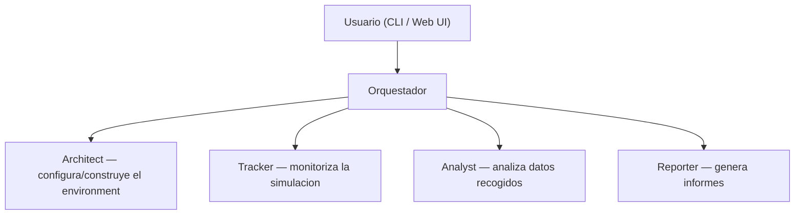
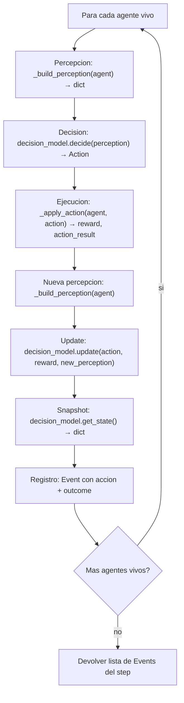
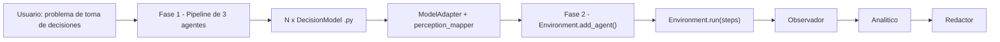
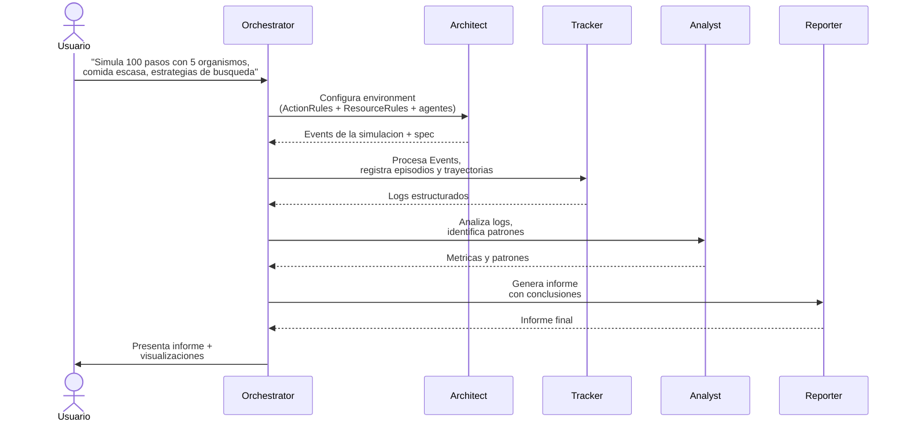

# Fase 2: Diseno del Laboratorio Virtual de Simulacion

**TFG**: Laboratorio virtual para la simulacion y analisis de paradigmas de toma de decisiones humanas mediante agentes inteligentes

---

## 1. Vision general

Este TFG es la segunda parte de un proyecto de dos fases:

- **Fase 1** (Pablo): pipeline de agentes LLM que investiga paradigmas de toma de decisiones, los formaliza y genera codigo Python (`DecisionModel`) listo para simular.
- **Fase 2** (este TFG): infraestructura para ejecutar esos modelos en un environment, observar su comportamiento, analizarlo y generar informes.

El sistema se construye como una **arquitectura multi-agente** donde un usuario interactua con un **orquestador conversacional** que coordina cuatro agentes especializados:



El usuario **solo habla con el orquestador**. Este interpreta la peticion y delega en los subagentes apropiados, coordinando el flujo completo: construccion del environment -> ejecucion -> observacion -> analisis -> informe.

### Flujo iterativo entre fases

La integracion entre Fase 1 y Fase 2 es un proceso iterativo acordado con el tutor:

1. Pablo describe de que tratan sus agentes (texto informal)
2. El Environment (Agente Plataforma) crea la sandbox con recursos y acciones apropiados
3. Se devuelve a Pablo una **spec declarativa**: `{"available_actions": [...], "resource_types": {...}, "grid": {...}}`
4. Pablo programa sus DecisionModels contra esa spec

Ni las acciones ni los recursos estan predefinidos — se configuran dinamicamente segun lo que Pablo necesite.

---

## 2. Decisiones de diseno

| Decision | Valor | Razon |
| --- | --- | --- |
| Tipo de mundo | Solo Grid 2D | YAGNI. Se amplia si hace falta |
| Agentes de simulacion | Codigo Python (reglas, EDOs, RL) | Nunca LLM en runtime de simulacion |
| Multi-agente | Si, desde el inicio | El script de Denis ya lo soporta |
| Mix de paradigmas | Si | Cada agente puede tener distinto DecisionModel |
| Visualizacion | Fuera del environment | Responsabilidad del Tracker/Reporter |
| Arquitectura | Composicion con Protocol | Flexible, intercambiable, Pythonico |
| Propiedad del estado | El DecisionModel (Fase 1) es dueno de todo el estado del paradigma. El Agent solo tiene posicion y alive | Separacion limpia; el Environment no necesita conocer las variables internas de cada modelo |
| Extensibilidad | Los nuevos paradigmas llegan como `.py` de la Fase 1 que implementan el Protocol `DecisionModel` | Se enchufa directamente sin tocar el framework |
| Configuracion de acciones/recursos | Dataclasses (`ActionRule`, `ResourceRule`) | Tipado, validable, serializable a/desde dict para que un LLM lo genere |
| Acciones atomicas | Mover y consumir son acciones separadas | Cada accion tiene un unico efecto, sistema mas generico y composable |
| Limites del Architect | Genera JSON specs de Environment (grid, acciones, recursos). No instancia el Environment ni selecciona DecisionModels | Los modelos vienen de la Fase 1; instanciar el Environment es una utilidad Python |
| Integracion Fase 1 | ModelAdapter con `perception_mapper` callback | El Environment no depende del codigo de Pablo; se mantiene generico |

---

## 3. Los 4 agentes + Orchestrator

### 3.1 Orchestrator

**Rol**: punto de entrada del usuario. Interpreta peticiones en lenguaje natural y coordina a los subagentes en funcion de las peticiones que reciba para modelar el environment y los agentes subsecuentes.

Decide que subagentes invocar y en que orden segun la peticion del usuario. Cada subagente corre con contexto aislado — solo el resumen final vuelve al Orchestrator. Pendiente de implementar.

### 3.2 Architect

**Rol**: interpretar peticiones en lenguaje natural y generar JSON specs validos para configurar environments de simulacion.

- Recibe una descripcion del escenario (via Orchestrator)
- Genera un JSON spec con grid, acciones (`ActionRule`) y recursos (`ResourceRule`)
- Valida el spec con una tool (`validate_spec`) y se autocorrige si falla
- No instancia el Environment (eso lo hace `spec_to_environment`, una utilidad Python)
- No selecciona DecisionModels (eso es responsabilidad de la Fase 1)

**Input**: descripcion del environment en lenguaje natural (via Orchestrator)
**Output**: JSON spec validado (grid + actions + resources)

### 3.3 Tracker

**Rol**: monitorizar el comportamiento de los agentes durante la simulacion.

- Registra eventos relevantes en cada paso
- Captura episodios (secuencias de eventos significativas)
- Traza trayectorias de decision de cada agente
- Accede al estado interno de los modelos via `DecisionModel.get_state()` — este metodo lo implementa la Fase 1 (Pablo) en cada modelo. Cada DecisionModel decide que variables internas exponer (ej: fat_reserves, ghrelin, hunger en el homeostatico; Q-table, epsilon en el hedonico). Sin `get_state()`, el Tracker no puede registrar el estado interno de los agentes. Preferimos hacerlo asi por una cuestion de separacion de responsabilidades.

**Input**: Events de la simulacion + snapshots del estado de cada agente (via `get_state()`)
**Output**: log estructurado de eventos, episodios y trayectorias

### 3.4 Analyst

**Rol**: procesar los datos del Tracker para extraer patrones.

- Identificar correlaciones entre comportamientos y consecucion de objetivos
- Detectar estrategias emergentes
- Comparar rendimiento entre agentes o entre configuraciones

**Input**: logs del Tracker
**Output**: patrones identificados, metricas, comparativas

### 3.5 Reporter

**Rol**: generar informes estructurados con los resultados.

- Sintetizar conclusiones del analisis
- Proponer mejoras en los modelos de comportamiento
- Generar documentacion legible (LaTeX -> PDF via tectonic)

**Input**: resultados del Analyst
**Output**: informe final estructurado

---

## 4. Environment base (Python)

Framework generico en Python que define las abstracciones de un mundo de simulacion. Es la "sandbox" sobre la que el Architect construye environments concretos y los DecisionModels de la Fase 1 operan como organismos.

El environment es codigo Python puro — no depende del Agent SDK. Los agentes IA (orquestador, observador, etc.) usan el SDK; el environment no.

### 4.1 Conceptos

| Concepto | Que es | Ejemplo |
| --- | --- | --- |
| `Grid` | Espacio 2D (ancho x alto) | Grid 10x10 |
| `Resource` | Objeto en el grid con propiedades | Comida en (3,4) con palatabilidad=0.8 |
| `ResourceRule` | Define un tipo de recurso y como se genera | `ResourceRule(type="food", properties={"palatability": (0.1, 1.0)}, count=5)` |
| `Agent` | Contenedor minimo: posicion + decision_model + alive | Organismo en (3,4) con HomeostaticModel |
| `DecisionModel` | Protocol con `decide()`, `update()` y `get_state()`. Dueno de todo el estado interno del paradigma | HomeostaticModel (fat, ghrelin, hunger...) |
| `Action` | Lo que un agente hace en un step (name + params) | `Action("eat")`, `Action("dance")` |
| `ActionRule` | Conecta un nombre de accion con un efecto en el mundo | `ActionRule("eat", ConsumeEffect("food", 1.0))` |
| `Effect` | Mecanica del mundo que se aplica al ejecutar una accion | `MoveEffect(dx=1, dy=0)`, `ConsumeEffect("food", 1.0)`, `NoopEffect()` |
| `Event` | Registro de algo que paso | "agente_1 comio en (3,4) step=42" |
| `Environment` | Orquesta el loop de simulacion | 100 steps, 5 agentes, comida escasa |

### 4.2 Effect types

Mecanicas del mundo — que puede pasar cuando un agente actua. Conjunto fijo, extensible anadiendo nuevos tipos cuando se necesiten.

```python
@dataclass
class MoveEffect:
    dx: int
    dy: int
    reward: float = 0.0

@dataclass
class ConsumeEffect:
    resource_type: str
    reward: float

@dataclass
class NoopEffect:
    reward: float = 0.0

Effect = MoveEffect | ConsumeEffect | NoopEffect
```

### 4.3 Configuracion: ActionRule y ResourceRule

Los nombres de acciones son libres — los define Pablo segun su paradigma. Los effects son las mecanicas del mundo que el Environment conoce.

```python
@dataclass
class ActionRule:
    name: str       # nombre libre: "drink", "dance", "move_up"...
    effect: Effect  # que pasa en el mundo

@dataclass
class ResourceRule:
    type: str                   # "food", "water", "gold"...
    properties: dict            # propiedades con rangos, ej: {"palatability": (0.1, 1.0)}
    count: int                  # instancias iniciales en el grid
    regenerate: bool = True     # si se regenera al consumirse
```

### 4.4 API

```python
# --- Tipos basicos ---

@dataclass
class Position:
    x: int
    y: int

@dataclass
class Action:
    name: str
    params: dict = field(default_factory=dict)

@dataclass
class Event:
    step: int
    agent_id: str
    action: Action
    outcome: dict = field(default_factory=dict)

@dataclass
class Resource:
    id: str
    position: Position
    properties: dict = field(default_factory=dict)

# --- Protocol para paradigmas de decision (Fase 1 lo implementa) ---

class DecisionModel(Protocol):
    def decide(self, perception: dict) -> Action: ...
    def update(self, action: Action, reward: float, new_perception: dict) -> None: ...
    def get_state(self) -> dict: ...

# --- Agent (contenedor minimo) ---

@dataclass
class Agent:
    id: str
    position: Position
    decision_model: DecisionModel | None = None
    alive: bool = True

# --- Environment ---

class Environment:
    def __init__(
        self,
        width: int,
        height: int,
        actions: list[ActionRule],
        resources: list[ResourceRule],
        seed: int | None = None,
    ) -> None: ...

    def add_agent(self, agent: Agent) -> None: ...
    def add_resource(self, resource: Resource) -> None: ...

    def step(self) -> list[Event]: ...
    def run(self, steps: int) -> list[Event]: ...
    def is_finished(self) -> bool: ...
    def get_state(self) -> dict: ...
    def get_spec(self) -> dict: ...
```

### 4.5 Detalles internos del Environment

**Constructor**: valida que no haya `ActionRule` o `ResourceRule` con nombres/tipos duplicados (`ValueError`). Construye registros internos (`_action_registry`, `_resource_rules`) y genera las instancias iniciales de recursos segun cada `ResourceRule.count`.

**`_apply_action`**: despacha por tipo de efecto en vez de logica fija. Devuelve `tuple[float, dict]` (reward + resultado de la accion). Acciones desconocidas devuelven `{"error": "unknown_action"}`.

**`_build_perception`**: devuelve un dict generico con recursos agrupados por tipo. Observabilidad completa: cada agente ve todos los recursos del grid. Incluye `last_action_result` (dict generico que se rellena tras aplicar la accion).

```python
# Ejemplo de percepcion generada:
{
    "x": 2, "y": 3,
    "grid_width": 10, "grid_height": 10,
    "step": 5,
    "resources": {
        "food": [{"x": 3, "y": 3, "type": "food", "palatability": 0.8}, ...],
        "water": [{"x": 1, "y": 1, "type": "water"}, ...],
    },
    "last_action_result": {"consumed": True, "resource_type": "food"},
}
```

**`get_spec()`**: devuelve la spec declarativa que se le manda a Pablo:

```python
# Ejemplo:
{
    "available_actions": ["move_up", "move_down", "eat", "rest"],
    "resource_types": {
        "food": {"properties": {"palatability": (0.1, 1.0)}, "count": 5, "regenerate": True}
    },
    "grid": {"width": 10, "height": 10},
}
```

**`Event.outcome`**: contiene `{"action_result": dict, "reward": float, "model_state": dict}`.

### 4.6 Flujo de un step



### 4.7 Que NO hace el environment base

- No implementa ningun paradigma de decision (eso es Fase 1)
- No visualiza nada (eso es el Tracker/Reporter)
- No usa LLMs en runtime de simulacion
- No persiste datos (eso lo hace el Observador con los Events)

---

## 5. Integracion con la Fase 1 (Pablo)

El punto de integracion es el **Protocol** `DecisionModel`. Los `.py` generados por el Builder de Pablo implementan su propio Protocol concreto. El Environment de la Fase 2 define un Protocol generico. Un **ModelAdapter** traduce entre ambos.



### 5.1 ModelAdapter

El adapter recibe un `perception_mapper` opcional que traduce la percepcion generica al formato concreto de Pablo:

```python
class ModelAdapter:
    def __init__(self, phase1_model, perception_mapper=None) -> None:
        self._model = phase1_model
        self._mapper = perception_mapper

    def decide(self, perception: dict) -> Action:
        mapped = self._mapper(perception) if self._mapper else perception
        p1_action = self._model.decide(mapped)
        return Action(name=p1_action.name, params=p1_action.params)

    def update(self, action: Action, reward: float, new_perception: dict) -> None:
        from decisionlab.models.protocol import Action as P1Action
        p1_action = P1Action(action.name, action.params)
        mapped = self._mapper(new_perception) if self._mapper else new_perception
        self._model.update(p1_action, reward, mapped)

    def get_state(self) -> dict:
        return self._model.get_state()
```

Sin mapper, la percepcion pasa directamente (pass-through). Cada paradigma nuevo solo necesita su propio mapper.

### 5.2 Perception mapper (ejemplo homeostatico)

```python
def homeostatic_perception_mapper(perception: dict):
    from decisionlab.models.protocol import Perception as P1Perception
    food_sources = tuple(
        {k: v for k, v in r.items() if k != "type"}
        for r in perception.get("resources", {}).get("food", [])
    )
    return P1Perception(
        position=(perception["x"], perception["y"]),
        grid_size=(perception["grid_width"], perception["grid_height"]),
        food_sources=food_sources,
        ate_food=perception.get("last_action_result", {}).get("consumed", False),
        step=perception.get("step", 0),
    )
```

Nota: los dicts de recursos incluyen una clave `"type"` extra (inyectada por `_spawn_resource`), que el mapper filtra antes de pasarla a `P1Perception`.

### 5.3 Por que un adaptador

La Fase 1 y la Fase 2 definen tipos distintos para los mismos conceptos, y eso es intencionado:

| Concepto | Fase 1 (Pablo) | Fase 2 (Environment generico) |
| --- | --- | --- |
| Action | `Action(name, params)` dataclass + constantes | `Action(name, params)` — mismo tipo |
| Perception | `Perception` dataclass tipado y frozen | `dict` generico |
| Position | `tuple[int, int]` | `Position(x, y)` dataclass |

### 5.4 Valor del proyecto

Un mismo Environment puede ejecutar agentes con paradigmas completamente distintos (homeostatico, hedonico, prospect theory...) y comparar su comportamiento. Cada paradigma solo necesita un mapper que traduzca la percepcion generica al formato esperado por el modelo.

---

## 6. Stack tecnico

| Componente | Tecnologia | Justificacion |
| --- | --- | --- |
| Lenguaje | Python (uv) | Continuidad con el script de referencia |
| LLM | Claude (Anthropic) | Capacidades de razonamiento y tool_use nativas |
| SDK | Anthropic Agent SDK (`claude-agent-sdk`) | Loop de agentes, subagentes, tools y contexto. |
| Interfaz | CLI (rich/typer) -> web despues | MVP rapido, separar logica de presentacion |
| Datos | JSON / SQLite | Logs de simulacion, resultados de analisis |
| Tests | pytest | Validacion del framework base |

### Por que Agent SDK y no frameworks de terceros

Se opta por el **Anthropic Agent SDK** en vez de frameworks como LangGraph, CrewAI o AutoGen:

1. **SDK oficial de Anthropic** — no es un framework de terceros, sino la herramienta oficial para construir agentes con Claude
2. **Consistencia con la Fase 1** — Pablo usa el mismo SDK para su pipeline, lo que unifica el stack del proyecto
3. **Subagentes nativos** — soporta directamente la arquitectura orquestador + subagentes especializados, cada uno con sus propias tools y contexto aislado
4. **Control sin boilerplate** — se define que tools tiene cada agente y que instrucciones recibe, sin escribir manualmente el loop de tool_use

---

## 7. Flujo de uso tipico



---

## 8. Desarrollo incremental

### Fase 2.1 — MVP (CLI)

- Environment base generico en Python (effect types, ActionRule, ResourceRule)
- ModelAdapter con perception_mapper para integracion con Fase 1
- Primer caso de uso: modelo metabolico/homeostatico de Pablo
- Orchestrator basico via CLI
- Architect funcional
- Tracker basico (logging de eventos)

### Fase 2.2 — Analisis e informes

- Analyst funcional
- Reporter funcional
- Pipeline completo: simulacion -> observacion -> analisis -> informe

### Fase 2.3 — Web UI

- Interfaz web sobre la logica existente
- Visualizacion de simulaciones en tiempo real
- Graficas interactivas del analisis
