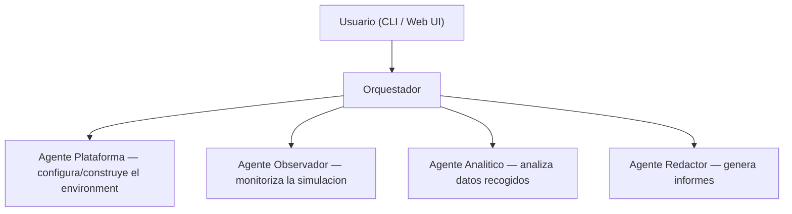
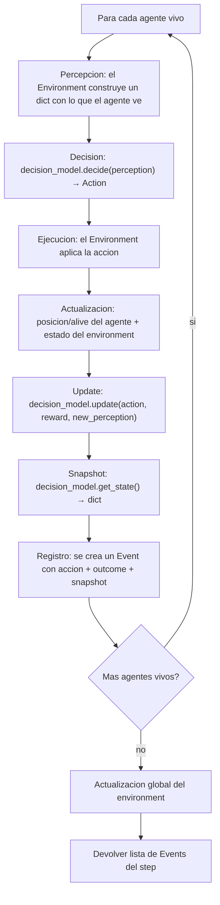
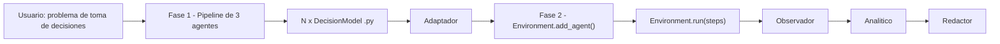
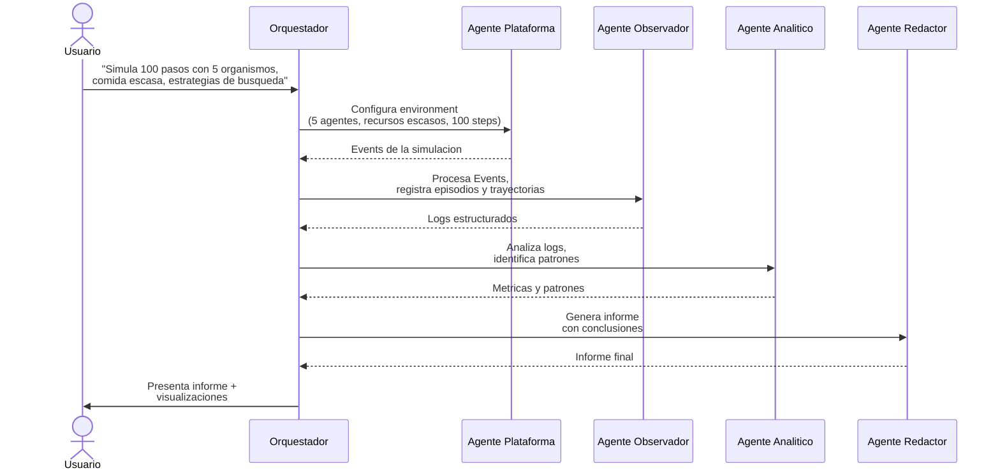

# Fase 2: Diseno del Laboratorio Virtual de Simulacion

**TFG**: Laboratorio virtual para la simulacion y analisis de paradigmas de toma de decisiones humanas mediante agentes inteligentes

---

## 1. Vision general

Este TFG es la segunda parte de un proyecto de dos fases:

- **Fase 1** (Pablo): pipeline de agentes LLM que investiga paradigmas de toma de decisiones, los formaliza y genera codigo Python (`DecisionModel`) listo para simular.
- **Fase 2** (este TFG): infraestructura para ejecutar esos modelos en un environment, observar su comportamiento, analizarlo y generar informes.

El sistema se construye como una **arquitectura multi-agente** donde un usuario interactua con un **orquestador conversacional** que coordina cuatro agentes especializados:



El usuario **solo habla con el orquestador**. Este interpreta la peticion y delega en los subagentes apropiados, coordinando el flujo completo: construccion del environment -&gt; ejecucion -&gt; observacion -&gt; analisis -&gt; informe.

---

## 2. Decisiones de diseno

| Decision | Valor | Razon |
| --- | --- | --- |
| Tipo de mundo | Solo Grid 2D | YAGNI. Se amplia si hace falta |
| Agentes de simulacion | Codigo Python (reglas, EDOs, RL) | Nunca LLM en runtime de simulacion |
| Multi-agente | Si, desde el inicio | El script de Denis ya lo soporta |
| Mix de paradigmas | Si | Cada agente puede tener distinto DecisionModel |
| Visualizacion | Fuera del environment | Responsabilidad del Observador/Redactor |
| Arquitectura | Composicion con Protocol | Flexible, intercambiable, Pythonico |
| Propiedad del estado | El DecisionModel (Fase 1) es dueño de todo el estado del paradigma. El Agent solo tiene posicion y alive | Separacion limpia; el Environment no necesita conocer las variables internas de cada modelo |
| Extensibilidad | Los nuevos paradigmas llegan como `.py` de la Fase 1 que implementan el Protocol `DecisionModel` | Se enchufa directamente sin tocar el framework |
| Limites del Agente Plataforma | Selecciona DecisionModels y configura el Environment (grid, recursos, reglas). No genera codigo de modelos | Los modelos vienen de la Fase 1 |
| Integracion Fase 1 | Adaptador entre el Protocol concreto de Pablo (Action dataclass, Perception dataclass tipado) y el Protocol generico del Environment (Action name+params, perception dict) | El Environment no depende del codigo de Pablo; se mantiene generico |

---

## 3. Los 4 agentes + orquestador

### 3.1 Orquestador

**Rol**: punto de entrada del usuario. Interpreta peticiones en lenguaje natural y coordina a los subagentes en función de las peticiones que reciba para modelar el environment y los agentes subsecuentes.

Es el agente principal del Agent SDK. Decide que subagentes invocar y en que orden segun la peticion del usuario. Cada subagente corre con contexto aislado — solo el resumen final vuelve al orquestador.

### 3.2 Agente Plataforma de Simulacion

**Rol**: construir y configurar environments de simulacion sobre el framework base en Python.

- Recibe especificaciones del orquestador (objetivos, recursos, restricciones, numero de agentes)
- Selecciona los DecisionModels (de la Fase 1) e instancia Agents (wrappers) con ellos
- Configura el Environment (tamanio grid, recursos, reglas de regeneracion)
- Ejecuta la simulacion paso a paso

**Input**: especificacion del environment en lenguaje natural (via orquestador) **Output**: environment configurado + datos de simulacion (Events)

### 3.3 Agente Observador

**Rol**: monitorizar el comportamiento de los agentes durante la simulacion.

- Registra eventos relevantes en cada paso
- Captura episodios (secuencias de eventos significativas)
- Traza trayectorias de decision de cada agente
- Accede al estado interno de los modelos via `DecisionModel.get_state()` — este metodo lo implementa la Fase 1 (Pablo) en cada modelo. Cada DecisionModel decide que variables internas exponer (ej: fat_reserves, ghrelin, hunger en el homeostatico; Q-table, epsilon en el hedonico). Sin `get_state()`, el Observador no puede registrar el estado interno de los agentes. Preferimos hacerlo así por una cuestión de separación de responsabilidades.

**Input**: Events de la simulacion + snapshots del estado de cada agente (via `get_state()`) **Output**: log estructurado de eventos, episodios y trayectorias

### 3.4 Agente Analitico

**Rol**: procesar los datos del Observador para extraer patrones.

- Identificar correlaciones entre comportamientos y consecucion de objetivos
- Detectar estrategias emergentes
- Comparar rendimiento entre agentes o entre configuraciones

**Input**: logs del Observador **Output**: patrones identificados, metricas, comparativas

### 3.5 Agente Redactor

**Rol**: generar informes estructurados con los resultados.

- Sintetizar conclusiones del analisis
- Proponer mejoras en los modelos de comportamiento
- Generar documentacion legible (Markdown, PDF)

**Input**: resultados del Agente Analitico **Output**: informe final estructurado

---

## 4. Environment base (Python)

Framework generico en Python que define las abstracciones de un mundo de simulacion. Es la "sandbox" sobre la que el Agente Plataforma construye environments concretos y los DecisionModels de la Fase 1 operan como organismos.

El environment es codigo Python puro — no depende del Agent SDK. Los agentes IA (orquestador, observador, etc.) usan el SDK; el environment no.

### 4.1 Conceptos

| Concepto | Que es | Ejemplo (caso Denis) |
| --- | --- | --- |
| `Grid` | Espacio 2D (ancho x alto) | Grid 10x10 |
| `Resource` | Objeto en el grid con propiedades | Comida en (3,4) con palatabilidad=0.8 |
| `Agent` | Contenedor minimo: posicion + decision_model + alive | Organismo en (3,4) con HomeostaticModel |
| `DecisionModel` | Protocol con `decide()`, `update()` y `get_state()`. Dueño de todo el estado interno del paradigma | HomeostaticModel (fat, ghrelin, hunger...) |
| `Action` | Lo que un agente hace en un step (generico: name + params) | Action("move", {"direction": "up"}), Action("eat"), Action("rest") |
| `Event` | Registro de algo que paso | "agente_1 comio en (3,4) step=42" |
| `Environment` | Orquesta el loop de simulacion | 100 steps, 5 agentes, comida escasa |

### 4.2 API

```python
from dataclasses import dataclass, field
from typing import Protocol

# --- Tipos basicos ---

@dataclass
class Position:
    x: int
    y: int

@dataclass
class Action:
    name: str
    params: dict = field(default_factory=dict)

@dataclass
class Event:
    step: int
    agent_id: str
    action: Action
    outcome: dict = field(default_factory=dict)

# --- Protocol para paradigmas de decision (Fase 1 lo implementa) ---
# El DecisionModel es dueno de todo el estado interno del paradigma.
# El Environment no gestiona estado del modelo — solo posicion y alive.
# El Observador accede al estado interno via get_state().

class DecisionModel(Protocol):
    def decide(self, perception: dict) -> Action: ...
    def update(self, action: Action, reward: float, new_perception: dict) -> None: ...
    def get_state(self) -> dict: ...

# --- Resource ---

@dataclass
class Resource:
    id: str
    position: Position
    properties: dict = field(default_factory=dict)
    # properties puede ser: {"type": "food", "palatability": 0.8, "energy": 10}

# --- Agent (contenedor minimo, no decide por si mismo) ---
# Todo el estado del paradigma vive en el DecisionModel.
# El Agent solo tiene posicion, alive, y una referencia al modelo.

@dataclass
class Agent:
    id: str
    position: Position
    decision_model: DecisionModel | None = None
    alive: bool = True

# --- Environment ---

class Environment:
    def __init__(self, width: int, height: int, seed: int | None = None): ...

    def add_agent(self, agent: Agent) -> None: ...
    def add_resource(self, resource: Resource) -> None: ...

    def step(self) -> list[Event]:
        """Avanza un paso: percepcion -> decision -> accion -> actualizacion."""
        ...

    def run(self, steps: int) -> list[Event]:
        """Ejecuta N pasos y devuelve todos los eventos."""
        ...

    def is_finished(self) -> bool:
        """Condicion de terminacion (todos muertos, objetivo cumplido, etc.)."""
        ...

    def get_state(self) -> dict:
        """Snapshot serializable del estado actual (para el Observador)."""
        ...
```

### 4.3 Flujo de un step (lo que tenía Denis)



### 4.4 Que NO hace el environment base

- No implementa ningun paradigma de decision (eso es Fase 1)
- No visualiza nada (eso es el Observador/Redactor)
- No usa LLMs en runtime de simulacion
- No persiste datos (eso lo hace el Observador con los Events)

---

## 5. Integracion con la Fase 1 (Pablo)

El punto de integracion es el **Protocol** `DecisionModel`. Los `.py` generados por el Builder de Pablo implementan su propio Protocol concreto. El Environment de la Fase 2 define un Protocol generico. Un **adaptador** traduce entre ambos.



### 5.1 Por que un adaptador

La Fase 1 y la Fase 2 definen tipos distintos para los mismos conceptos, y eso es intencionado:

| Concepto | Fase 1 (Pablo) | Fase 2 (Environment generico) |
| --- | --- | --- |
| Action | `Action(name: str, params: dict)` dataclass + constantes `UP`, `DOWN`, etc. | `Action(name: str, params: dict)` — mismo tipo |
| Perception | `Perception` dataclass tipado y frozen (position, food_sources, ate_food...) | `dict` generico |
| Position | `tuple[int, int]` | `Position(x, y)` dataclass |

Ambas fases comparten el mismo tipo `Action(name, params)`. La diferencia principal es la **percepcion**: la Fase 1 usa un `Perception` dataclass tipado (campos concretos para grid con comida), mientras la Fase 2 usa un `dict` generico para soportar cualquier paradigma.

El adaptador traduce entre la percepcion tipada y el dict generico:

```python
class ModelAdapter:
    """Adapta un DecisionModel de la Fase 1 al Protocol generico de la Fase 2."""

    def __init__(self, phase1_model):
        self._model = phase1_model

    def decide(self, perception: dict) -> Action:
        # Traduce dict generico -> Perception tipado de Pablo
        p1_perception = Perception(
            position=(perception["x"], perception["y"]),
            grid_size=(perception["grid_width"], perception["grid_height"]),
            food_sources=tuple(perception.get("nearby_resources", [])),
            ate_food=perception.get("ate_food", False),
            step=perception.get("step", 0),
        )
        # Llama al modelo de Pablo
        p1_action = self._model.decide(p1_perception)
        return Action(name=p1_action.name)

    def update(self, action: Action, reward: float, new_perception: dict) -> None:
        # Reconstruye Action y Perception de la Fase 1
        from decisionlab.models.protocol import Action as P1Action
        p1_action = P1Action(action.name)
        p1_perception = self._to_typed_perception(new_perception)
        self._model.update(p1_action, reward, p1_perception)

    def get_state(self) -> dict:
        return self._model.get_state()
```

Asi el Environment no depende del codigo de Pablo, y los modelos de Pablo no necesitan cambiar para funcionar en el Environment.

### 5.2 Valor del proyecto

Un mismo Environment puede ejecutar agentes con paradigmas completamente distintos (homeostatico, hedonico, prospect theory...) y comparar su comportamiento. Cada paradigma solo necesita un adaptador que traduzca sus tipos al Protocol generico.

---

## 6. Stack tecnico

| Componente | Tecnologia | Justificacion |
| --- | --- | --- |
| Lenguaje | Python (uv) | Continuidad con el script de referencia |
| LLM | Claude (Anthropic) | Capacidades de razonamiento y tool_use nativas |
| SDK | Anthropic Agent SDK (`claude-agent-sdk`) | Loop de agentes, subagentes, tools y contexto. |
| Interfaz | CLI (rich/typer) -&gt; web despues | MVP rapido, separar logica de presentacion |
| Datos | JSON / SQLite | Logs de simulacion, resultados de analisis |
| Tests | pytest | Validacion del framework base |

### Por que Agent SDK y no frameworks de terceros

Se opta por el **Anthropic Agent SDK** en vez de frameworks como LangGraph, CrewAI o AutoGen:

1. **SDK oficial de Anthropic** — no es un framework de terceros, sino la herramienta oficial para construir agentes con Claude
2. **Consistencia con la Fase 1** — Pablo usa el mismo SDK para su pipeline, lo que unifica el stack del proyecto
3. **Subagentes nativos** — soporta directamente la arquitectura orquestador + subagentes especializados, cada uno con sus propias tools y contexto aislado
4. **Control sin boilerplate** — se define que tools tiene cada agente y que instrucciones recibe, sin escribir manualmente el loop de tool_use

---

## 7. Flujo de uso tipico



---

## 8. Desarrollo incremental

### Fase 2.1 — MVP (CLI)

- Environment base en Python (clases del framework)
- Primer caso de uso concreto: modelo metabolico basado en el script de Denis
- Orquestador basico via CLI
- Agente Plataforma funcional
- Agente Observador basico (logging de eventos)

### Fase 2.2 — Analisis e informes

- Agente Analitico funcional
- Agente Redactor funcional
- Pipeline completo: simulacion -&gt; observacion -&gt; analisis -&gt; informe

### Fase 2.3 — Web UI

- Interfaz web sobre la logica existente
- Visualizacion de simulaciones en tiempo real
- Graficas interactivas del analisis